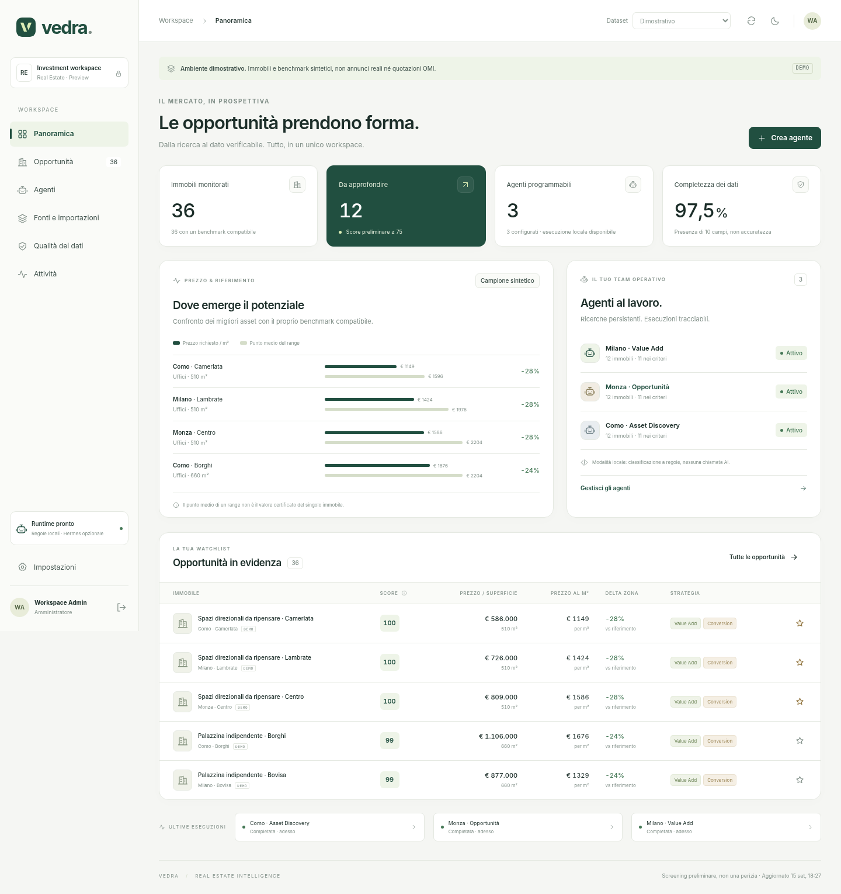

# Vedra · Real Estate Intelligence

**Dai criteri di ricerca a un workspace di opportunità verificabili.**

Preview funzionante per deal origination e screening immobiliare: dashboard italiana, ricerche persistenti, acquisizione controllata, qualità dei dati, confronto dei prezzi e classificazione tramite **Hermes + skills + tool deterministici**.



> **Questa distribuzione parte in modalità dimostrativa.** I 36 immobili iniziali di Milano, Monza e Como e i 120 record benchmark sono sintetici. Non sono annunci acquisiti dai portali e non sono quotazioni OMI. Il codice di acquisizione reale è presente, ma richiede una fonte autorizzata, configurazione e prova sul sito effettivo. Non sono inclusi account, chiavi o contratti con fornitori dati.

## Avvio in pochi minuti

Richiede **Python 3.11+**; verificato qui con Python 3.13. Non serve Node per avviare la dashboard, non serve `npm install`, non serve un database esterno.

```bash
cd vedra-real-estate
python3 -m venv .venv
source .venv/bin/activate
python -m pip install -r requirements.txt
python scripts/setup.py
python scripts/run.py
```

Apri **http://localhost:8000**. Il setup stampa email e password iniziali e le salva nel file locale `.env` con permessi restrittivi. L’email predefinita è `admin@vedra.local`; la password è generata casualmente, non condivisa nel repository.

Su Windows: attiva il virtual environment con `.venv\Scripts\Activate.ps1`; usa `python` al posto di `python3` quando appropriato. Il percorso nativo Windows non è stato verificato in questa consegna.

Alla prima apertura puoi subito configurare un agente demo, premere **Esegui ora**, leggere il log, confrontare gli immobili e scaricare gli export. Non sono semplici animazioni: i job elaborano fixture HTML locali attraverso parser, database e scoring reali. Il badge DEMO resta visibile.

**Alternativa Docker, per la modalità locale:**

```bash
python3 scripts/setup.py
docker compose up --build -d
```

Compose pubblica soltanto `127.0.0.1:8000`; la configurazione è inclusa ma Docker non è stato eseguito nell’ambiente di sviluppo di questa consegna. Per un URL cliente con HTTPS leggi [DEPLOYMENT](docs/DEPLOYMENT.md).

## Cosa è implementato

| Area | Funzioni operative |
|---|---|
| Dashboard | Panoramica, tabella e schede, filtri, ordinamento, vista per agente, confronto fino a 3 immobili, temi chiaro/scuro, layout responsive |
| Agenti | Crea/modifica ricerca, criteri, fonti, runtime locale o Hermes, frequenza, avvio manuale, pausa, log, annullamento |
| Acquisizione | JSON-LD, selettori CSS, paginazione limitata, rendering Playwright opzionale, import CSV e HTML |
| Stato | SQLite WAL, ricerca e run persistenti, snapshot di configurazione, storico delle variazioni, rilevazione duplicati candidati |
| Qualificazione | Regole locali esplicite oppure analisi semantica Hermes con citazioni verificate; filtri numerici nel backend |
| Prezzi | Prezzo/m², benchmark importabili, compatibilità di zona/tipo/stato/superficie, score con formula visibile |
| Qualità | Campi presenti/assenti, completezza sul campione, errori e blocchi delle fonti, dati mancanti non inventati |
| Revisione | Preferiti, shortlist, stato di valutazione, note degli utenti |
| Export | CSV, Excel con formule e valori calcolati, scheda Word con fonti e avvertenze |
| Accesso | Sessioni HttpOnly, CSRF, ruoli admin/analyst/viewer, nessuna registrazione pubblica |
| Handoff | Due skills Hermes, bridge CLI, script di setup, configurazione container, CI, test e documentazione |

Vedra è un nome provvisorio. Il design e il marchio testuale si modificano in `frontend/src/views.js`, `icons.js`, `styles.css` e `frontend/index.html`.

## Attivare Hermes, senza un fork

Hermes è un servizio separato. La dashboard non chiama direttamente il suo gateway e non ne espone la chiave.

Con Hermes già installato sulla **stessa macchina**:

```bash
hermes profile create vedra
hermes -p vedra setup
python scripts/configure_hermes.py --profile vedra
hermes -p vedra gateway
```

Riavvia Vedra dopo la configurazione. In **Impostazioni → Verifica runtime** controlla che il gateway sia raggiungibile e che esponga le capacità richieste. Poi modifica una ricerca e seleziona **Hermes · skills + tools**.

Il configuratore installa esclusivamente `vedra-origination` e `vedra-classification` nel profilo dedicato, configura una porta locale separata (8645), genera o riusa la chiave di quel profilo e collega il bridge. Non clona il profilo personale e non installa o configura il provider LLM al tuo posto. I token non sono stampati.

La sequenza effettiva è:

```text
Dashboard → coda persistente Vedra
                 ↓
      raccolta e pre-screening in codice
                 ↓
    ci sono task semantici nuovi o arretrati?
          no → termina, nessun LLM
          sì → Hermes Runs API
                    ↓
          skill origination → bridge collect (cache)
          skill classification → JSON + quote
                    ↓
          backend valida → calcola → salva → UI
```

**Non viene ricostruito un agente generalista.** Hermes gestisce il turno AI, le skills, gli strumenti e la sessione. Un piccolo worker applicativo conserva la coda e i tempi del prodotto, rende utilizzabile la preview anche senza modello e impedisce doppie run. Lo scheduler Jobs di Hermes non viene duplicato in parallelo: un eventuale cron esterno può accodare soltanto ricerche impostate su Manuale.

Dettagli, isolamento, rete tra container, errori e contratto HTTP in [HERMES](docs/HERMES.md).

## Acquisire dati reali

La modalità iniziale non effettua richieste a Idealista, Immobiliare.it o Casa.it. Non ci sono connettori presentati come funzionanti senza essere stati provati.

1. Individua una fonte di cui siano verificati accesso automatizzato e riuso. Aggiungi il **dominio esatto** a `LIVE_ALLOWED_DOMAINS` in `.env` e riavvia l’app.
2. Passa a **Dati reali → Fonti e importazioni → Nuova fonte**. Configura URL ricerca, link agli annunci, eventuale pagina successiva e selettori dei campi. JSON-LD viene letto prima; i selettori possono integrare o correggere i campi.
3. Registra il riferimento al permesso e premi **Test**. Il test estrae un solo campione e non certifica la copertura del sito.
4. Crea una ricerca che usa quella fonte, con un piccolo limite iniziale, e premi **Esegui ora**.
5. Esamina **Qualità dei dati**, schede, snapshot ed errori. Una fonte bloccata resta bloccata: non viene sostituita silenziosamente da dati demo.

In alternativa importa un CSV strutturato o un HTML acquisito legittimamente. I tracciati demo sono scaricabili anche dalla finestra di importazione. Il campo `currency` va dichiarato: in assenza di indicazione esplicita la valuta è sconosciuta, non automaticamente EUR. Anche compravendita, stato e tipo di superficie non vengono presunti.

Questo connettore è **generico e configurabile**, non uno scraper universale. Siti con JSON proprietario, login, token di sessione, contenuti distribuiti su altri domini o protezioni anti-bot possono richiedere un’integrazione specifica. Vedi [DATA](docs/DATA.md).

## Benchmark e scoring

Non esiste un download OMI automatico nascosto. Importa un CSV normalizzato con provenienza e periodo; il tracciato non coincide automaticamente con i file grezzi dei fornitori.

Il confronto richiede corrispondenza di **comune, micro-zona, tipologia, stato, base della superficie, valuta, operazione e natura demo/reale**. Non viene assegnata una zona OMI tramite geocoding approssimativo. La micro-zona deve essere già correttamente mappata e verificata.

```text
prezzo_mq = prezzo / superficie
riferimento = (benchmark_min + benchmark_max) / 2
sconto_percentuale = (1 - prezzo_mq / riferimento) × 100

punti_prezzo = clamp(35 + sconto_percentuale × 1,4; 0; 70)
punti_strategie = min(30; 15 × numero_strategie_con_evidenza)
score_preliminare = round(punti_prezzo + punti_strategie)
```

Senza dati sufficienti o benchmark compatibile, **score e delta rimangono non disponibili**. La formula è una euristica di priorità da calibrare con il cliente: non è un modello finanziario validato, non stima margini, non certifica fattibilità o probabilità di profitto. Una citazione nel testo di un annuncio dimostra la provenienza della dichiarazione, non che sia vera.

## Struttura del repository

```text
backend/app/
  main.py              API, sessioni, controllo workspace, bridge Hermes
  connectors/          parser JSON-LD/CSS e HTTP/browser limitato
  services/            acquisizione, classificazione, scoring, import/export
  db.py                schema SQLite e transazioni
backend/tests/         test unitari, contratti, integrazione locale e sicurezza
frontend/src/          dashboard ES modules + CSS, nessuna build necessaria
hermes/skills/         due skills con script stdlib incorporato
scripts/               setup, avvio, collegamento Hermes, verifica UI, backup, zip
fixtures/              soltanto dati sintetici e configurazioni di esempio
docs/                  architettura, dati, Hermes, deployment e demo
```

Le API locali sono documentate a `/api/docs` dopo il login; lo schema macchina è `/api/openapi.json`. Il reference funziona senza CDN.

## Test e verifiche

```bash
python -m pip install -r requirements-dev.txt
pytest -q
node scripts/check_frontend.mjs
python -m playwright install chromium
python scripts/test_ui.py
```

La suite UI avvia un backend temporaneo, genera una password temporanea, utilizza dati sintetici e salva screenshot. Node serve soltanto al controllo sintattico opzionale. Tutti i dettagli di ciò che è stato effettivamente eseguito sono in [TEST_REPORT](TEST_REPORT.md).

## Limiti della preview

Non sono implementati urbanistica/PGT, perizie CTU/OCR, ricerca di transati, exit price, rendimento, invio email, deduplica con immagini, multitenancy, SSO o alta disponibilità. Non ci sono API Openapi/OMI o altri provider premium collegati. I loro dati possono essere normalizzati e importati, ma l’integrazione diretta resta separata.

La dashboard carica al massimo 2.000 immobili per vista e 100 run recenti; avvisa quando il campione è troncato. Un agente controlla un **comune esatto**, non un raggio geografico. Il limite annunci è **per fonte e per run**. Una variazione di contenuto viene storicizzata; assenza da una scansione parziale non significa immobile venduto o annuncio rimosso.

È una base per una preview privata e verificabile, non un prodotto enterprise già certificato o un impegno sulla copertura di portali terzi. L’assenza di una pagina o di un’autorizzazione è un risultato dell’esperimento, non una ragione per inventare il dato.

## Prima di GitHub e prima del cliente

Non caricare `.env`, `data/`, backup o annunci del cliente. Il `.gitignore` e lo script `package.py` escludono questi contenuti. Nel repository non sono incluse le conversazioni o i documenti privati del brief.

```bash
python scripts/package.py
```

Il pacchetto contiene un manifest SHA256. La licenza applicativa non è stata impostata automaticamente come open-source: scegli i termini di pubblicazione o cessione con il cliente prima di distribuire il codice a terzi.

Per la presentazione segui [DEMO_PLAYBOOK](docs/DEMO_PLAYBOOK.md). Per mettere il link online leggi [DEPLOYMENT](docs/DEPLOYMENT.md) e [SECURITY](SECURITY.md).
